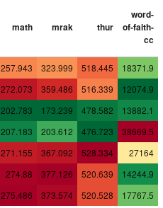

# Weekday Mean Energy Usage

Simple application that produces a heatmap showing mean daily energy usage broken down by day of the week and by site.



To see the visualization, you have to load this application inside a Jupyter notebook using the `%load` command.
This will bring the content of the application file into the notebook cell.
Execute the cell again to start the application.

```
# Cell 0
% load app.py
```
